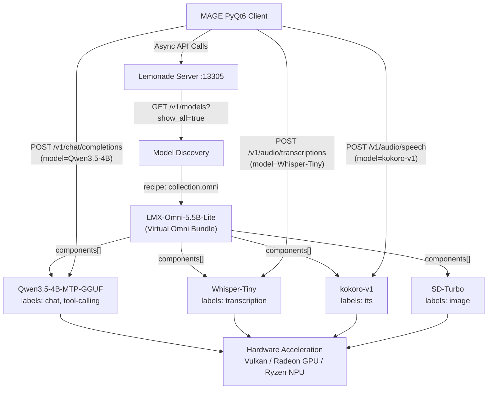
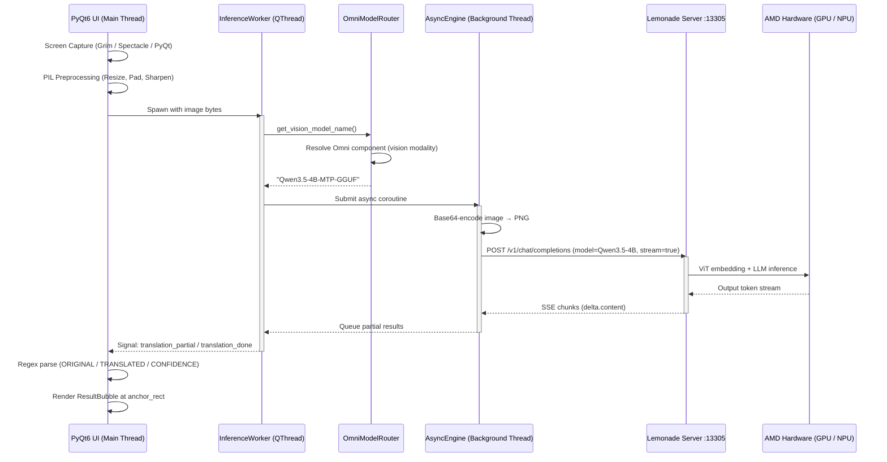

# MAGE: Backend Architecture

MAGE is a real-time, low-latency gaming HUD overlay that enables seamless on-screen visual translation, live audio transcription, and interactive chat assistant capabilities. This document outlines how MAGE leverages **AMD's Lemonade local runtime** and its **Omni Model** architecture to construct a high-performance, fully local AI translation pipeline — with every inference call running on-device through AMD hardware.

---

## 1. The Local Omnirouter Pattern

Traditional local AI integration is often plagued by fragmented execution environments, conflicting dependencies, and high memory footprints caused by running multiple independent inference servers. 

MAGE solves this problem by treating the embedded **AMD Lemonade C++ runtime** (running on local port `13305`) as a unified **Local Omnirouter**, built on top of Lemonade's [Omni Model](https://lemonade-server.ai/docs/dev/lemonade-omni/) architecture.



### Key Architectural Benefits
* **Unified Interface**: The local Lemonade instance exposes a single, OpenAI-compatible REST API. The MAGE client utilizes a standard `AsyncOpenAI` client pointing to `http://localhost:13305/v1`, eliminating custom payload serialization and protocol mismatch.
* **Omni Model Discovery**: At startup, MAGE's [OmniModelRouter](./packages/xian-vl/src/xian/omni_router.py) queries `GET /v1/models?show_all=true` to discover installed Omni Models. When it finds a model with `recipe: "collection.omni"` (or an `LMX-Omni-` prefixed ID), it decomposes the virtual bundle into its individual component models and builds a per-modality routing table. This means the user selects a single "Omni" model in the MAGE settings, and the system automatically resolves the correct sub-model for each task — vision, chat, ASR, TTS — without manual configuration.
* **Concurrent Model Orchestration**: MAGE routes tasks representing different modalities to different component models within the Omni collection:
  * **Vision-Language Models (VLMs)** (e.g., Qwen-VL) for visual translation and OCR via `/v1/chat/completions`.
  * **Text Large Language Models (LLMs)** (e.g., Qwen3.5-Instruct, Qwen3.6-35B) for contextual game-lore explanation, chat, and in-game text translation.
  * **Automatic Speech Recognition (ASR)** (e.g., Whisper-Large-v3-Turbo, Whisper-Tiny) for live voice capture via `/v1/audio/transcriptions`.
  * **Text-to-Speech (TTS)** (e.g., kokoro-v1) for speaking translations aloud via `/v1/audio/speech`.
* **No Environment Fragmentation**: All routing is handled out-of-band by the Lemonade binary. Multiple model payloads are managed concurrently behind the single routing endpoint without loading separate Python runtimes or conflicting CUDA/ROCm configurations.

---

## 2. Lemonade Omni Models: Virtual Multi-Model Collections

The central innovation MAGE leverages from Lemonade is the **Omni Model** pattern ([docs](https://lemonade-server.ai/docs/dev/lemonade-omni/)). An Omni Model is a virtual model registered with `recipe: "collection.omni"` that bundles multiple specialized models into a single logical unit. Users install one Omni Model and get a complete multi-modal AI stack.

### Shipped Omni Models

| Omni Model | LLM | Image | ASR | TTS |
|---|---|---|---|---|
| **LMX-Omni-52B-Halo** | Qwen3.6-35B-A3B-MTP-GGUF | Flux-2-Klein-9B-GGUF (gen + edit) | Whisper-Large-v3-Turbo | kokoro-v1 |
| **LMX-Omni-5.5B-Lite** | Qwen3.5-4B-MTP-GGUF | SD-Turbo (gen only) | Whisper-Tiny | kokoro-v1 |

The naming follows the convention `LMX-Omni-<total params>-<class>`, where `Halo` targets high-VRAM Strix Halo systems and `Lite` targets 32 GB APUs.

### Client-Side Omni Decomposition via OmniModelRouter

MAGE implements its own [OmniModelRouter](./packages/xian-vl/src/xian/omni_router.py) to decompose Omni bundles into per-modality routing decisions. At startup:

1. The router queries `GET /v1/models?show_all=true` (Omni models are hidden from the default listing; the `show_all` flag surfaces them).
2. It scans the response for any model with `recipe: "collection.omni"` or an `LMX-Omni-` prefixed ID.
3. It reads the `components[]` array and the `labels[]` on each component to build a routing table:
   * `tool-calling` / `chat` / `reasoning` labels → **LLM** modality
   * `vision` / `vl` labels → **Vision** modality (falls back to LLM if no dedicated vision model exists)
   * `transcription` / `asr` labels → **ASR** modality
   * `tts` / `text-to-speech` labels → **TTS** modality
   * `image` / `edit` labels → **Image generation/editing** modality
4. The [VLProcessor](./packages/xian-vl/src/xian/pipeline.py) then calls `router.vision()` for OCR tasks, `router.llm()` for chat/translation, and `router.asr()` for transcription — each resolving transparently to the correct component model ID.

This means the user selects **one model** (e.g., `LMX-Omni-5.5B-Lite`) in the MAGE settings dialog, and the system automatically fans out to `Qwen3.5-4B-MTP-GGUF` for vision/chat, `Whisper-Tiny` for speech recognition, and `kokoro-v1` for text-to-speech — all served from the same Lemonade process on port 13305.

### Lemonade-Specific API Surface

Beyond the standard OpenAI-compatible endpoints, MAGE uses Lemonade's proprietary APIs (wrapped by [LemonadeClient](./packages/xian-vl/src/xian/lemonade_client.py)) for model lifecycle and multimodal tool calls:

| Endpoint | Purpose | MAGE Usage |
|---|---|---|
| `POST /v1/chat/completions` | LLM / VLM inference | Visual translation, chat, query translation |
| `POST /v1/audio/transcriptions` | Speech-to-text (ASR) | Cinematic Mode audio capture, Raid Mode live voice |
| `POST /v1/audio/speech` | Text-to-speech (TTS) | "Speak" button on translation bubbles |
| `POST /v1/pull` | Download a model | On-demand model downloads (`ModelPullWorker`, streamed as SSE progress) |
| `POST /v1/load` / `POST /v1/unload` | VRAM lifecycle | Prewarming the target model into VRAM at startup; dynamic model swapping |
| `GET /v1/models?show_all=true` | Discovery (incl. Omni) | OmniModelRouter population |
| `GET /v1/stats` | Inference telemetry | Post-inference diagnostics logging |

---

## 3. Hardware-Optimized Acceleration

To achieve near-zero frame stuttering during active gameplay, MAGE offloads processing to the hardware-accelerated backends inside AMD's Lemonade.

* **Dynamic Resource Mapping**: Depending on the host system's hardware capabilities and local memory thresholds, Lemonade automatically maps model compilation graphs onto optimized system engines:
  * **AMD Radeon GPUs**: Leveraged via Vulkan / ROCm acceleration.
  * **Ryzen AI NPUs**: Leveraged via ONNX Runtime / Ryzen AI NPU drivers for energy-efficient, low-power laptop inference.
  * **Ryzen CPUs**: Falls back to optimized AVX2/AVX512 instruction sets when GPU/NPU limits are exceeded.
* **VRAM Prewarming**: To prevent runtime performance spikes, MAGE calls a prewarming routine during initialization. The [PrewarmWorker](./apps/mage-client/src/mage/workers.py) delegates to `VLProcessor.prewarm_model()`, which issues a `/v1/load` call (falling back to a throwaway inference if explicit load is unsupported) to bring the target Omni Model's components fully into VRAM before translation commands are issued.

---

## 4. Vision-Language Payload Lifecycle

The complete data loop of a visual translation request is orchestrated as follows. Each step leverages the Omni Model routing described above — the `model` parameter sent to Lemonade is the specific component model ID resolved by `OmniModelRouter`, not the virtual Omni bundle name.



### 1. Frame Capture (Linux / Wayland Compatibility)
On Linux/Wayland, standard compositors prevent application windows from reading pixel buffers of other windows. MAGE captures screen regions by executing platform-specific screenshot CLI commands:
* **KDE Plasma**: Invokes `spectacle -b -n -f -o` to screenshot in background mode.
* **GNOME**: Attempts DBus method call `org.gnome.Shell.Screenshot.Screenshot` or invokes `gnome-screenshot`.
* **Generic Wayland**: Invokes `grim -` to pipe screenshot data directly to stdout.
* **Fallback**: Uses PyQt's `QScreen.grabWindow(0)` (supported on X11, Windows, and macOS).

### 2. Client-Side Image Preprocessing
Before sending data over the local loopback connection, the PyQt6 client applies PIL-based image manipulation:
* **Dimension Clamp**: Scaled using LANCZOS resampling if the image width or height exceeds maximum dimensions.
* **Square Padding**: The image is padded to a perfect square shape. This prevents the Vision Transformer (ViT) in the local model from stretching the image, which would degrade text readability.
* **Sharpening**: A PIL `SHARPEN` filter is applied to make text edges crisper, reducing OCR character hallucination.
* *Note*: The client does not perform tensor operations; image data is base64-encoded as a lossless PNG and formatted directly into the OpenAI-compatible JSON payload.

### 3. Non-Blocking Async Request
The visual translation request is submitted to a background event loop managed by the `AsyncEngine` (running on a dedicated OS thread called `xian-async-engine`). The client sends the query using a non-blocking POST request to:
`http://localhost:13305/v1/chat/completions`

Because this communication occurs on a background thread, the PyQt6 main thread remains fully responsive, updating overlay visual states at 60 FPS without stutter.

### 4. Lemonade Model Execution
Upon receiving the payload, Lemonade tokenizes the visual and textual prompts, passes them to the compiler graph, and schedules execution onto the selected hardware backend (llama.cpp, Ryzen AI NPU runtime, etc.). Results are streamed back in real-time as token deltas.

### 5. Client Parsing & Overlay Canvas Rendering
Instead of parsing complex JSON coordinate formats from the VLM (which can be slow and brittle), the model is instructed via system prompt to output a structured three-part layout:
```text
ORIGINAL:
[Extracted Source Language Text]

TRANSLATED:
[Direct Target Language Translation]

CONFIDENCE:
[Float Score 0.0 - 1.0]
```
The client parses this structure using high-performance regular expressions. A semi-transparent `ResultBubble` widget is overlayed near the user's selected region (`anchor_rect`) using global desktop coordinates. If the model confidence falls below a set threshold, the UI highlights the border in orange to warn the user of speculative translations.
