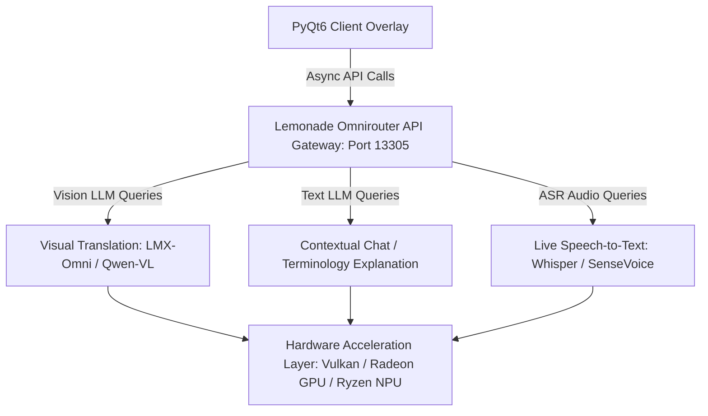
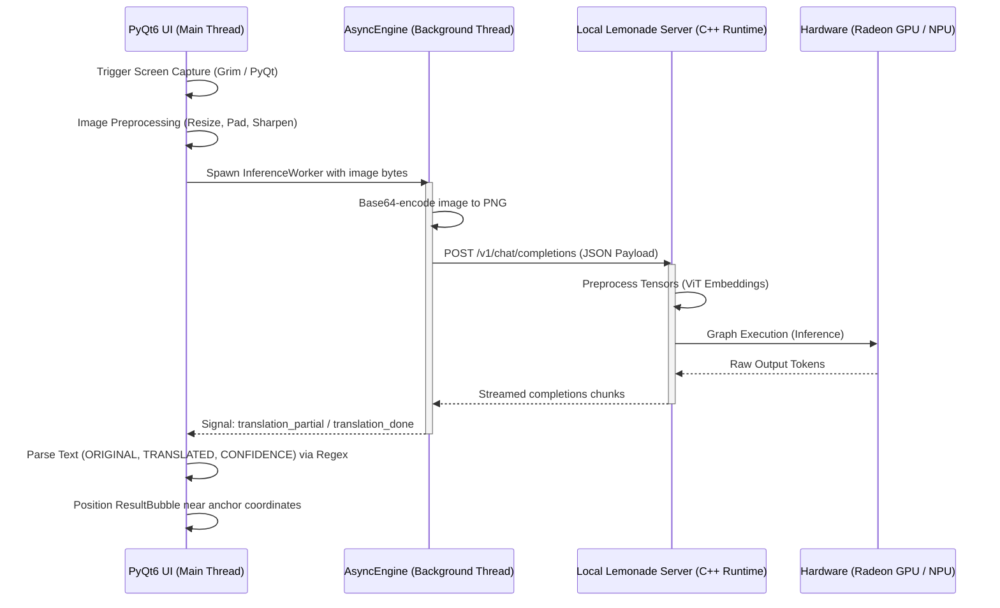

# MAGE: Backend Architecture

MAGE is a real-time, low-latency gaming HUD overlay that enables seamless on-screen visual translation, live audio transcription, and interactive chat assistant capabilities. This document outlines how MAGE leverages **AMD's Lemonade local runtime** to construct a high-performance local AI translation pipeline.

---

## 1. The Local Omnirouter Pattern

Traditional local AI integration is often plagued by fragmented execution environments, conflicting dependencies, and high memory footprints caused by running multiple independent inference servers. 

MAGE solves this problem by treating the embedded **AMD Lemonade C++ runtime** (running on local port `13305`) as a unified **Local Omnirouter**. 



### Key Architectural Benefits
* **Unified Interface**: The local Lemonade instance exposes a single, OpenAI-compatible REST API. The MAGE client utilizes a standard `AsyncOpenAI` client pointing to `http://localhost:13305/v1`, eliminating custom payload serialization and protocol mismatch.
* **Concurrent Model Orchestration**: MAGE routes tasks representing different modalities to different model configurations:
  * **Vision-Language Models (VLMs)** (e.g., LMX-Omni or Qwen-VL) for visual translation and OCR.
  * **Text Large Language Models (LLMs)** (e.g., Qwen-Instruct or Llama) for contextual game-lore explanation and chat.
  * **Automatic Speech Recognition (ASR)** (e.g., Whisper or SenseVoice) for live voice capture.
* **No Environment Fragmentation**: All routing is handled out-of-band by the Lemonade binary. Multiple model payloads are managed concurrently behind the single routing endpoint without loading separate Python runtimes or conflicting CUDA/ROCm configurations.

---

## 2. Hardware-Optimized Acceleration

To achieve near-zero frame stuttering during active gameplay, MAGE offloads processing to the hardware-accelerated backends inside AMD's Lemonade.

* **Dynamic Resource Mapping**: Depending on the host system's hardware capabilities and local memory thresholds, Lemonade automatically maps model compilation graphs onto optimized system engines:
  * **AMD Radeon GPUs**: Leveraged via Vulkan / ROCm acceleration.
  * **Ryzen AI NPUs**: Leveraged via ONNX Runtime / Ryzen AI NPU drivers for energy-efficient, low-power laptop inference.
  * **Ryzen CPUs**: Falls back to optimized AVX2/AVX512 instruction sets when GPU/NPU limits are exceeded.
* **VRAM Prewarming**: To prevent runtime performance spikes, MAGE calls a prewarming routine during initialization. The [PrewarmWorker](file:///home/clem/src/cursor/xian-vl/apps/mage-client/src/mage/workers.py#L588) triggers a `/v1/pull` configuration call, loading the target model fully into VRAM before translation commands are issued.

---

## 3. Vision-Language Payload Lifecycle

The complete data loop of a visual translation request is orchestrated as follows. 



### 1. Frame Capture (Linux / Wayland Compatibility)
On Linux/Wayland, standard compositors prevent application windows from reading pixel buffers of other windows. MAGE captures screen regions by executing platform-specific screenshot CLI commands:
* **KDE Plasma**: Invokes `spectacle -b -n -f -o` to screenshot in background mode.
* **GNOME**: Attempts DBus method call `org.gnome.Shell.Screenshot.Screenshot` or invokes `gnome-screenshot`.
* **Generic Wayland**: Invokes `grim -` to pipe screenshot data directly to stdout.
* **Fallback**: Uses PyQt's `QScreen.grabWindow(0)` (supported on X11, Windows, and macOS).

### 2. Client-Side Image Preprocessing
Before sending data over the local loopback connection, the PyQt6 client applies PIL-based image manipulation:
* **Dimension Clamp**: Scaled using LANCZOS resampling if the image width or height exceeds maximum dimensions.
* **Square Padding**: The image is padded to a perfect square shape. This prevents the Vision Transformer (ViT) in the local model from stretching the image, which would degrade text readability.
* **Sharpening**: A PIL `SHARPEN` filter is applied to make text edges crisper, reducing OCR character hallucination.
* *Note*: The client does not perform tensor operations; image data is base64-encoded as a lossless PNG and formatted directly into the OpenAI-compatible JSON payload.

### 3. Non-Blocking Async Request
The visual translation request is submitted to a background event loop managed by the `AsyncEngine` (running on a dedicated OS thread called `xian-async-engine`). The client sends the query using a non-blocking POST request to:
`http://localhost:13305/v1/chat/completions`

Because this communication occurs on a background thread, the PyQt6 main thread remains fully responsive, updating overlay visual states at 60 FPS without stutter.

### 4. Lemonade Model Execution
Upon receiving the payload, Lemonade tokenizes the visual and textual prompts, passes them to the compiler graph, and schedules execution onto the selected hardware backend (llama.cpp, Ryzen AI NPU runtime, etc.). Results are streamed back in real-time as token deltas.

### 5. Client Parsing & Overlay Canvas Rendering
Instead of parsing complex JSON coordinate formats from the VLM (which can be slow and brittle), the model is instructed via system prompt to output a structured three-part layout:
```text
ORIGINAL:
[Extracted Source Language Text]

TRANSLATED:
[Direct Target Language Translation]

CONFIDENCE:
[Float Score 0.0 - 1.0]
```
The client parses this structure using high-performance regular expressions. A semi-transparent `ResultBubble` widget is overlayed near the user's selected region (`anchor_rect`) using global desktop coordinates. If the model confidence falls below a set threshold, the UI highlights the border in orange to warn the user of speculative translations.
